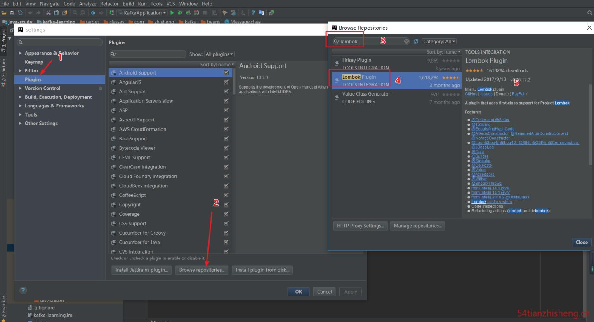
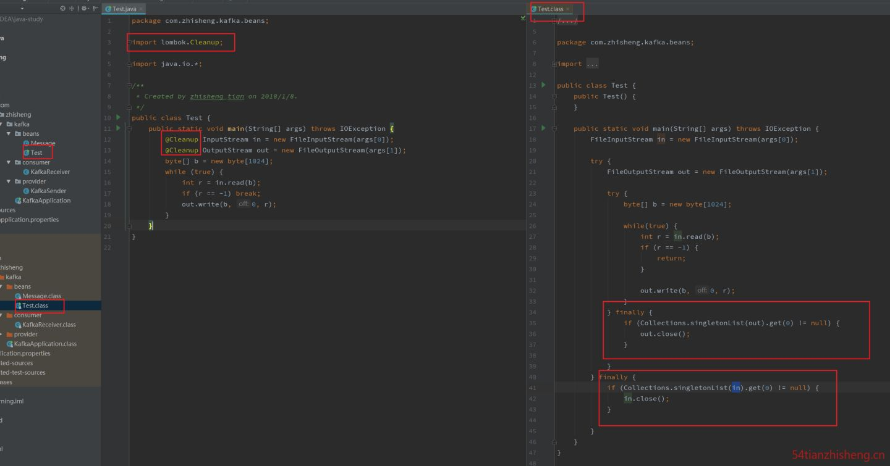

# lombok


> install



> dependency

``` pom
<dependency>
    <groupId>org.projectlombok</groupId>
    <artifactId>lombok</artifactId>
    <version>1.16.18</version>
    <scope>provided</scope>
</dependency>
```
> lombok.config

``` config
config.stopBubbling = true
lombok.addLombokGeneratedAnnotation = true

```

> annotation

@Data
@Setter
@Getter
@Log4j
@AllArgsConstructor
@NoArgsConstructor
@EqualsAndHashCode
@NonNull
@Cleanup
@ToString
@RequiredArgsConstructor
@Value
@SneakyThrows
@Synchronized
@Accessors(chain=true)

> @Accessors(chain=true)

链式访问，该注解设置chain=true，生成setter方法返回this（也就是返回的是对象），代替了默认的返回void。

> @Data

注解在 类 上；提供类所有属性的 get 和 set 方法，此外还提供了equals、canEqual、hashCode、toString 方法。


> @Setter

注解在 属性 上；为单个属性提供 set 方法; 注解在 类 上，为该类所有的属性提供 set 方法， 都提供默认构造方法。


> @Getter

注解在 属性 上；为单个属性提供 get 方法; 注解在 类 上，为该类所有的属性提供 get 方法，都提供默认构造方法。


> @Log4j

注解在 类 上；为类提供一个 属性名为 log 的 log4j 日志对象，提供默认构造方法。


> @AllArgsConstructor

注解在 类 上；为类提供一个全参的构造方法，加了这个注解后，类中不提供默认构造方法了。


> @NoArgsConstructor

注解在 类 上；为类提供一个无参的构造方法。


> @EqualsAndHashCode

注解在 类 上, 可以生成 equals、canEqual、hashCode 方法。


> @NonNull

注解在 属性 上，会自动产生一个关于此参数的非空检查，如果参数为空，则抛出一个空指针异常，也会有一个默认的无参构造方法。


> @Cleanup

这个注解用在 变量 前面，可以保证此变量代表的资源会被自动关闭，默认是调用资源的 close() 方法，如果该资源有其它关闭方法，可使用 @Cleanup(“methodName”) 来指定要调用的方法，也会生成默认的构造方法



> @ToString

这个注解用在 类 上，可以生成所有参数的 toString 方法，还会生成默认的构造方法。


> @RequiredArgsConstructor

这个注解用在 类 上，使用类中所有带有 @NonNull 注解的或者带有 final 修饰的成员变量生成对应的构造方法。


> @Value

这个注解用在 类 上，会生成含所有参数的构造方法，get 方法，此外还提供了equals、hashCode、toString 方法。


> @SneakyThrows

这个注解用在 方法 上，可以将方法中的代码用 try-catch 语句包裹起来，捕获异常并在 catch 中用 Lombok.sneakyThrow(e) 把异常抛出，可以使用 @SneakyThrows(Exception.class) 的形式指定抛出哪种异常，也会生成默认的构造方法。


> @Synchronized

这个注解用在 类方法 或者 实例方法 上，效果和 synchronized 关键字相同，区别在于锁对象不同，对于类方法和实例方法，synchronized 关键字的锁对象分别是类的 class 对象和 this 对象，而 @Synchronized 的锁对象分别是 私有静态 final 对象 lock 和 私有 final 对象 lock，当然，也可以自己指定锁对象，此外也提供默认的构造方法。


